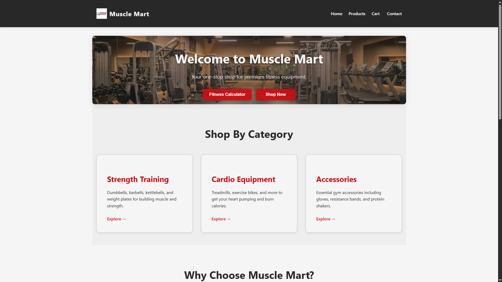

# Muscle Mart

Muscle Mart is a modern e-commerce platform for fitness enthusiasts, offering a wide range of premium fitness equipment. Built with React and Vite, this application provides a seamless shopping experience with features like product browsing, cart management, and fitness calculators.



## Tech Stack

- **Frontend**: React 19 with Hooks and Context API
- **Build Tool**: Vite 7 for fast development and production builds
- **Styling**: CSS with modern layout techniques (Flexbox, Grid)
- **Routing**: Hash-based routing for client-side navigation
- **State Management**: React Context API for global state

## Features

- **Product Catalog**: Browse our extensive collection of fitness equipment including strength training gear, cardio machines, and accessories
- **Shopping Cart**: Add products to your cart, adjust quantities, and manage your selections
- **Fitness Calculator**: Calculate your BMI and daily calorie needs based on your personal metrics
- **Responsive Design**: Fully responsive layout that works on mobile, tablet, and desktop devices
- **Indian Number Formatting**: All prices displayed using the Indian numbering system (e.g., 1,00,000)
- **Modern UI**: Clean, contemporary design with smooth animations and transitions

## Pages

1. **Home** - Welcome page with company information and featured content
2. **Products** - Browse our complete catalog of fitness equipment
3. **Fitness Calculator** - Calculate your BMI and daily calorie requirements
4. **Contact** - Get in touch with our team
5. **Cart** - Review and manage your selected items

## Project Structure

```
src/
├── components/     # Reusable UI components
├── contexts/       # React Context providers
├── data/           # Static data file
├── pages/          # Page-level components
├── styles/         # CSS stylesheets
├── utils/          # Utility functions
├── App.jsx         # Main application component
└── main.jsx        # Entry point
```

## Key Components

- **Header**: Navigation bar with logo and menu
- **Hero**: Featured banner with call-to-action buttons
- **ProductCard**: Individual product display with add-to-cart functionality
- **Cart**: Shopping cart management with quantity controls
- **Calculator**: BMI and calorie calculation tool
- **ContactForm**: Form for customer inquiries with validation
